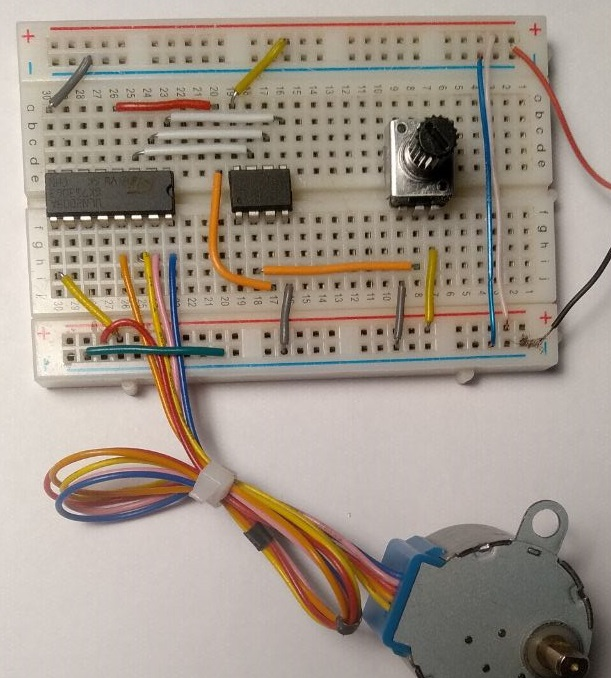
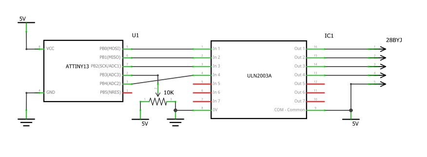

Demo of how to control a stepper motor 28BYJ by ATtiny13. The motor rotates back and forth at an angle determined by the potentiometer.

## Components
- ATtiny13
- Stepper motor 28BYJ
- ULN2003
- Potentiometer

